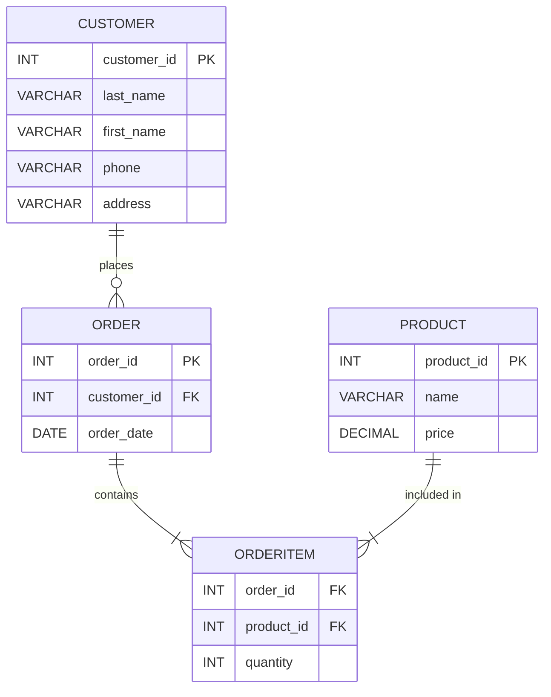

# Проектирование реляционной базы данных: Продажа спортивных товаров по каталогу

## Целью данной работы является проектирование реляционной базы данных для учета продаж спортивных товаров по каталогу. Задача включает определение сущностей, связей, проектирование таблиц в НФБК, создание SQL-запросов и разработку триггера, процедуры и транзакции.

### На ER-диаграмме изображены основные сущности: Customer, Product, Order и OrderItem, а также связи между ними.




### Таблицы и их описание:
```
Клиент - Customer (customer_id PK, last_name, first_name, phone, address)
Товар - Product (product_id PK, name, price)
Заказ - Order (order_id PK, customer_id FK, order_date)
Позиция заказа - OrderItem (order_id FK, product_id FK, quantity)
```

### SQL-код:

С помощью SQL запросов мы создали все таблицы:

Создаем таблицу клиента:
```
CREATE TABLE Customer (
    customer_id INT PRIMARY KEY AUTO_INCREMENT,
    last_name VARCHAR(50) NOT NULL,
    first_name VARCHAR(50) NOT NULL,
    phone VARCHAR(20) NOT NULL,
    address VARCHAR(100) NOT NULL
);
```

Создаем таблицу товара:
```
CREATE TABLE Product (
    product_id INT PRIMARY KEY,
    name VARCHAR(100) NOT NULL,
    price DECIMAL(10,2) NOT NULL CHECK (price > 0)
);
```

Создаем таблицу заказа:
```
CREATE TABLE `Order` (
    order_id INT PRIMARY KEY AUTO_INCREMENT,
    customer_id INT NOT NULL,
    order_date DATE NOT NULL,
    FOREIGN KEY (customer_id) REFERENCES Customer(customer_id)
);
```

Создаем таблицу с позицией заказа:
```
CREATE TABLE OrderItem (
    order_id INT,
    product_id INT,
    quantity INT NOT NULL CHECK (quantity > 0),
    PRIMARY KEY (order_id, product_id),
    FOREIGN KEY (order_id) REFERENCES `Order`(order_id),
    FOREIGN KEY (product_id) REFERENCES Product(product_id)
);
```


Запросы, которые сделаем к таблицам:

```
-- Customers
INSERT INTO Customer (last_name, first_name, phone, address) VALUES ('Иванов', 'Петр', '1234567', 'ул. Ленина, 1');
INSERT INTO Customer (last_name, first_name, phone, address) VALUES ('Петров', 'Иван', '2345678', 'ул. Мира, 3');
INSERT INTO Customer (last_name, first_name, phone, address) VALUES ('Сидоров', 'Алексей', '3456789', 'ул. Победы, 5');

-- Products
INSERT INTO Product (product_id, name, price) VALUES (1001, 'Мяч футбольный', 1500.00);
INSERT INTO Product (product_id, name, price) VALUES (1002, 'Скакалка', 500.00);
INSERT INTO Product (product_id, name, price) VALUES (1003, 'Теннисная ракетка', 3000.00);

-- Orders
INSERT INTO `Order` (customer_id, order_date) VALUES (1, '2025-06-11');
INSERT INTO `Order` (customer_id, order_date) VALUES (2, '2025-06-10');
INSERT INTO `Order` (customer_id, order_date) VALUES (3, '2025-06-09');

-- OrderItems
INSERT INTO OrderItem VALUES (1, 1001, 2);
INSERT INTO OrderItem VALUES (1, 1002, 1);
INSERT INTO OrderItem VALUES (2, 1003, 1);

```


Обновляем данные:

```
UPDATE Customer SET phone = '7654321' WHERE customer_id = 1;
UPDATE Product SET price = 3200 WHERE product_id = 1003;
UPDATE OrderItem SET quantity = 3 WHERE order_id = 1 AND product_id = 1001;
```


Удаляем данные:

```
DELETE FROM OrderItem WHERE order_id = 1 AND product_id = 1002;
DELETE FROM `Order` WHERE order_id = 3;
DELETE FROM Customer WHERE customer_id = 3;
```


Запросы:

```
SELECT * FROM Product WHERE price > 1000;
SELECT o.order_id, c.last_name, oi.product_id, oi.quantity
FROM `Order` o
JOIN Customer c ON o.customer_id = c.customer_id
JOIN OrderItem oi ON o.order_id = oi.order_id;

SELECT p.name, oi.quantity
FROM OrderItem oi
JOIN Product p ON oi.product_id = p.product_id
WHERE oi.order_id = 1;
```


### Триггер, процедура, транзакция:

```
DELIMITER //
CREATE TRIGGER check_quantity_before_insert
BEFORE INSERT ON OrderItem
FOR EACH ROW
BEGIN
    IF NEW.quantity <= 0 THEN
        SIGNAL SQLSTATE '45000'
        SET MESSAGE_TEXT = 'Количество товара должно быть больше нуля';
    END IF;
END;
//
DELIMITER ;
```

```
DELIMITER //
CREATE TRIGGER check_quantity_before_insert
BEFORE INSERT ON OrderItem
FOR EACH ROW
BEGIN
    IF NEW.quantity <= 0 THEN
        SIGNAL SQLSTATE '45000'
        SET MESSAGE_TEXT = 'Количество товара должно быть больше нуля';
    END IF;
END;
//
DELIMITER ;
```

```
DELIMITER //
CREATE TRIGGER check_quantity_before_insert
BEFORE INSERT ON OrderItem
FOR EACH ROW
BEGIN
    IF NEW.quantity <= 0 THEN
        SIGNAL SQLSTATE '45000'
        SET MESSAGE_TEXT = 'Количество товара должно быть больше нуля';
    END IF;
END;
//
DELIMITER ;
```

В результате проделанной работы была спроектирована реляционная база данных, соответствующая требованиям НФБК. Были определены основные сущности и связи, реализованы таблицы и примеры SQL-запросов. Разработаны триггер, хранимая процедура и транзакция для обеспечения корректности и удобства работы с данными.


